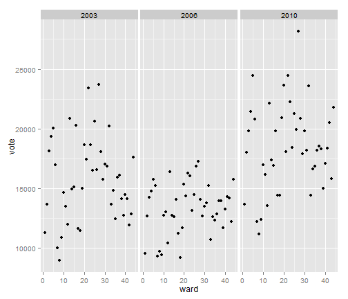
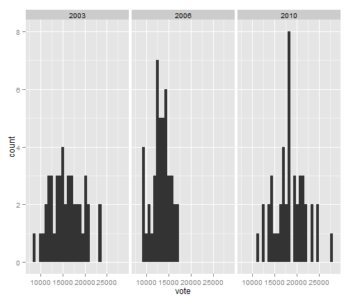

Toronto mayoral election results
========================================================


```r
library(dplyr)
library(ggplot2)
election_results <- read.csv(file = "..//data//election_results.csv")
elections_df <- tbl_df(election_results)
elections <- group_by(elections_df, year, ward)
votes <- summarise(elections, vote = sum(votes))
```


```r
election_results %.% group_by(year, candidate) %.% summarise(vote = sum(votes)) %.% 
    filter(vote > 5000) %.% arrange(year, desc(vote))
```

```
## Source: local data frame [14 x 3]
## Groups: year
## 
##    year         candidate   vote
## 1  2003     Miller, David 299385
## 2  2003        Tory, John 263189
## 3  2003     Hall, Barbara  63751
## 4  2003    Nunziata, John  36021
## 5  2003      Jakobek, Tom   5277
## 6  2006      MILLER DAVID 332969
## 7  2006     PITFIELD JANE 188932
## 8  2006    LEDREW STEPHEN   8078
## 9  2006 ALEXANDER MICHAEL   5247
## 10 2006    CASTILLO JAIME   5215
## 11 2010          FORD ROB 383501
## 12 2010 SMITHERMAN GEORGE 289832
## 13 2010     PANTALONE JOE  95482
## 14 2010       ROSSI ROCCO   5012
```


```r
qplot(ward, vote, data = votes, facets = ~year)
```

 

```r
qplot(vote, data = votes, facets = ~year)
```

 


